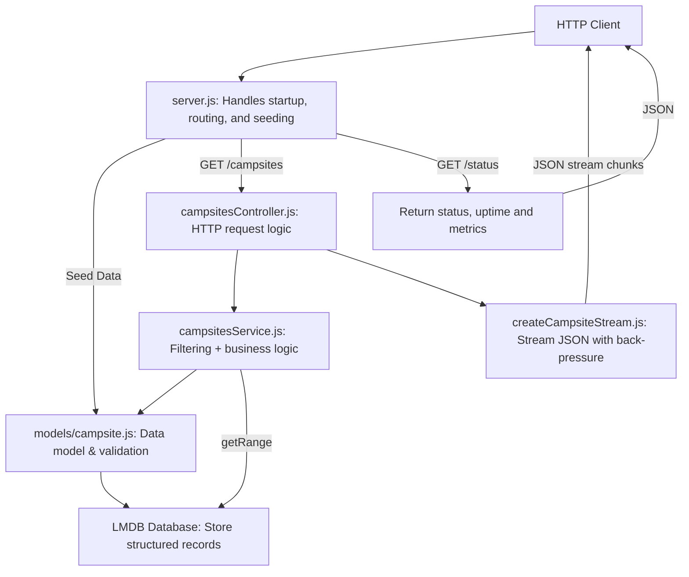
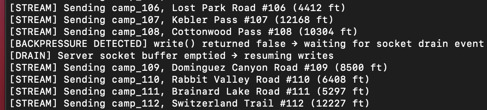

# Campsite Streaming Server

This project is a lightweight and modular Node.js HTTP server for streaming Colorado dispersed campsite data from an LMDB store using the `lmdb-js` library. One of my favorite pastimes is camping with my dog, Willow, and all the coordinates come from spots I’ve saved on Google Maps during our adventures. 


The code is divided into focused modules: a server entry point for seeding the database, routing, and startup; a controller for request handling; a service layer for filtering and business logic; and a streaming layer that pushes JSON chunks while respecting back-pressure.

Every request is logged—showing endpoints hit and each campsite streamed—so you can trace behavior in real time. Additionally, before and after the `/campsites` stream runs (and each time `/status` is called), we sample CPU and memory usage, converting raw bytes to human-readable MB values and reporting heap usage as a percentage. Those metrics are logged to the console, offering immediate visibility into resource consumption alongside functional logging.

## Architecture



## Getting Started

### Use Node.js v20 (via nvm)

```bash
nvm use
```

### Install Dependencies

```bash
npm install
```

### Start the server

```bash
npm start
```

The server will run at: `http://localhost:3000`


## API Endpoints

### GET `/campsites`

**Description**  
Streams all campsite records as a single JSON array. The data is sent incrementally (chunk by chunk), so you never load the entire dataset into memory at once.

**Request**  
```http
GET http://localhost:3000/campsites
```

**Query Parameters (optional)**  
- `min_elevation` (number): Return only campsites at or above this elevation (in feet).  
- `max_elevation` (number): Return only campsites at or below this elevation (in feet).  

**Request:**  
```
GET http://localhost:3000/campsites?min_elevation=9000&max_elevation=11000
```

**Response**  
A streamed JSON array of campsite objects. Each object includes the following fields:

```json
[
  {
    "id": "camp_001",
    "name": "Brainard Lake Road",
    "location": {
      "latitude": 40.0213,
      "longitude": -105.5856
    },
    "region": "Indian Peaks",
    "elevation_ft": 10400
  },
  …
]
```

### GET `/status`

**Description**  
Returns a simple health check, including server uptime and a real-time snapshot of CPU and memory usage.

**Request**  
```http
GET http://localhost:3000/status
```

**Response**  
A JSON object containing:

```json
{
  "status": "ok",
  "uptime": 12345.67,
  "metrics": {
    "cpuUsage": "2.15%",
    "memory": {
      "rss": "36.52 MB",
      "heapTotal": "9.38 MB",
      "heapUsed": "5.21 MB",
      "heapUsagePercent": "55.6%",
      "external": "18.27 MB"
    }
  }
}
```
## Data Validation

Data validation is performed at key stages in the application to ensure the integrity and consistency of the data. Before seeding, raw JSON data is validated to meet required structure and type constraints using the `Campsite.fromRaw()` method. When the data is retrieved from the database for streaming, each record is validated again to ensure it adheres to the expected format, preventing invalid or malformed data from being sent to clients.

## Metrics

The server tracks its own resource usage to provide real-time performance insights. Each time a client requests `/campsites`, the server calls `getMetrics()` immediately before and after streaming data. This function samples CPU usage over a short (100 ms) window and collects memory statistics, including resident set size (RSS), heap allocation, heap usage, heap usage percentage, and external memory, all reported in megabytes. These before-and-after metrics are logged to the console, allowing you to see the impact of streaming on server resources.

The `/status` endpoint also exposes these metrics in its JSON response, along with the server's uptime in seconds. This makes it easy to integrate the server with health checks, dashboards, or monitoring tools, and to observe resource consumption trends over time.

## Logging

The server logs key events for transparency and debugging:

- **Requests:** Each incoming HTTP request logs the endpoint and method.
- **Streaming:** Every campsite streamed logs its `id`, `name`, and `elevation_ft`.
- **Backpressure:** When the response buffer fills, logs `[BACKPRESSURE DETECTED]` and pauses streaming until the buffer drains, then logs `[DRAIN]` when streaming resumes.
- **Client Disconnects:** If a client closes the connection mid-stream, logs `[ABORTED] Client closed connection` and stops streaming.
- **Errors:** All unhandled errors are logged with stack traces for troubleshooting.
- **Metrics:** Before and after streaming `/campsites`, logs CPU and memory usage snapshots.

These logs provide a clear, real-time view of server activity, resource usage, and any issues encountered during operation.

## Error Handling

- **400 Bad Request:**  
  Returned when a client provides invalid query parameters (e.g., non-numeric values for `min_elevation` or `max_elevation`). The response includes a JSON error message specifying the invalid parameter.
  ```json
  { "error": "Invalid min_elevation: not_a_number" }
  ```

- **404 Not Found:**  
  Triggered when the route is unsupported or method is not GET.

- **500 Internal Server Error:**  
  If an unexpected error occurs, returns a JSON response with:
  ```json
  { "error": "Something went wrong." }
  ```

- **Client Disconnects:**  
  The server listens for client termination via `req.on('close')` and aborts the stream gracefully with log output:
  ```
  [ABORTED] Client closed connection
  ```

### Backpressure

When a client reads data slowly (for example, due to a slow network or intentional throttling), the server may encounter backpressure. This means the internal buffer for the HTTP response is full, and the server must pause sending more data until the client catches up. The server handles this by:

- Checking the return value of `res.write()`. If it returns `false`, the server waits for the `'drain'` event before resuming streaming.
- Logging backpressure events for observability.

This mechanism ensures the server does not overwhelm slow clients and always produces valid, complete JSON output, even under adverse network conditions.

## Testing

To verify that the streaming endpoint behaves exactly as intended in a real-world scenario, I used a lightweight, live‐server test suite that issues actual HTTP requests against a running server on `localhost:3000`. By launching the server and then executing npm test, we spin up a single Node.js script that sequentially fires off `GET` requests—both with and without query parameters—and simulates a throttled client to trigger back‐pressure. Each request accumulates the streamed JSON response, parses it, and asserts overall structure and content before logging a pass or fail. Because these tests connect to the server over TCP rather than invoking route handlers in isolation, they confirm end‐to‐end functionality: from URL parsing and LMDB iteration all the way through streaming, back‐pressure handling, and graceful teardown, in the exact same environment that will run in production.

To run the test suite, make sure the server is running, then run:

```bash
npm test
```

### Tests included

- `testGetAllCampsites`: Validates streaming of full dataset.
- `testFilterMinElevation`: Ensures lower bound filtering.
- `testFilterMaxElevation`: Ensures upper bound filtering.
- `testFilterElevationRange`: Validates combined elevation filters.
- `testStatusEndpoint`: Verifies server health status.
- `testClientDisconnect`: Ensures the server gracefully handles a client disconnecting mid-stream without crashing.
- `simulateSlowClient`: Simulates a throttled client to trigger backpressure.

## Manual Testing

### Using Postman

Send a `GET` request to:

```
http://localhost:3000/campsites
```

Add query parameters to test filters. You’ll receive a streamed JSON array.

### Using cURL

```bash
curl "http://localhost:3000/campsites?min_elevation=9500&max_elevation=10500"
```

To simulate a slow connection for backpressure:

```bash
curl --limit-rate 1k "http://localhost:3000/campsites"
```

With a small dataset, the server may not always log backpressure events because the Node.js HTTP response buffer is large enough to hold all the data being sent. If the entire JSON response fits into the buffer, `res.write()` will always return true, meaning the server never needs to pause and wait for the 'drain' event. As a result, the backpressure log messages will not appear.

**For example:**  
To test this, I seeded 500 campsite objects into the database. When running a slow client, I observed that backpressure was triggered and the log message appeared after streaming about 100+ campsites. This demonstrated that with a larger dataset and a slow client, the server’s backpressure handling and logging work as expected.

